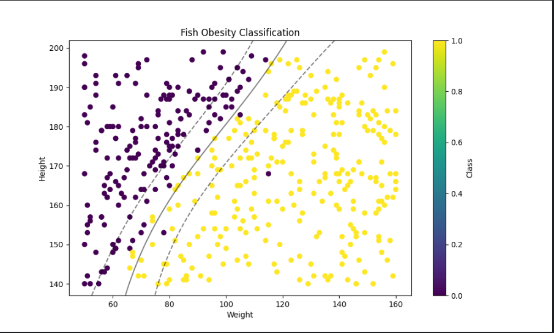

# AI Files Repository for Postgraduate Studies

Welcome to the AI files repository for my postgraduate studies. Here, you will find scripts and files that have been developed as part of my Artificial Intelligence course.

📁 Available Files

1. `use_coat.py`
    * 📝 Description:
    The use_coat.py file is a simple script that determines whether a person should or should not wear a coat based on the provided temperature input.
    * 🚀 Usage: To run the script, you can follow the steps below:
        ```
        python use_coat.py
        ```
    The script will prompt you to enter the current temperature. Based on this temperature, the script will determine whether you should wear a coat or not.

2. `happiness_tax.py`
    * 📝 Description:
    The happiness_tax.py file is a more complex script that performs the following operations:
      * Joins two CSV files into a single dataframe.
      * Calculates a learning metric to determine whether a person is happy or not in the country, based on the GDP.
      * 🚀 Usage: To run the happiness_tax.py script, follow the steps below:
         ```
         python happiness_tax.py
         ```
    The script will prompt you for the paths of the CSV files you wish to join. After joining the files, the script will calculate the learning metric to determine the person's happiness based on the country's GDP.

3. `fish_obesity.py`
   [PART 1] -> Using training data
   * 📝 Description:
   The happiness_tax.py file is a more complex script that performs the following operations:
      * Joins two CSV files into a single dataframe.
      * Calculate matrices and generate graph with machine learning of obese fish by height.
      * 🚀 Usage: To run the fish_obesity.py script, follow the steps below:
         ```
         python happiness_tax.py
         ```
      The script will ask for the paths of the CSV files you want to join. After joining the files, the script will separate the test data into 80%/20% and then calculate and generate a graph of obese fish based on weight and height.    * Image return:
      

    [PART 2] -> Using test data

* Feel free to explore and use these files as a reference or for educational purposes. If you have any questions or suggestions, please feel free to contact me.
    
Thank you for visiting the repository!